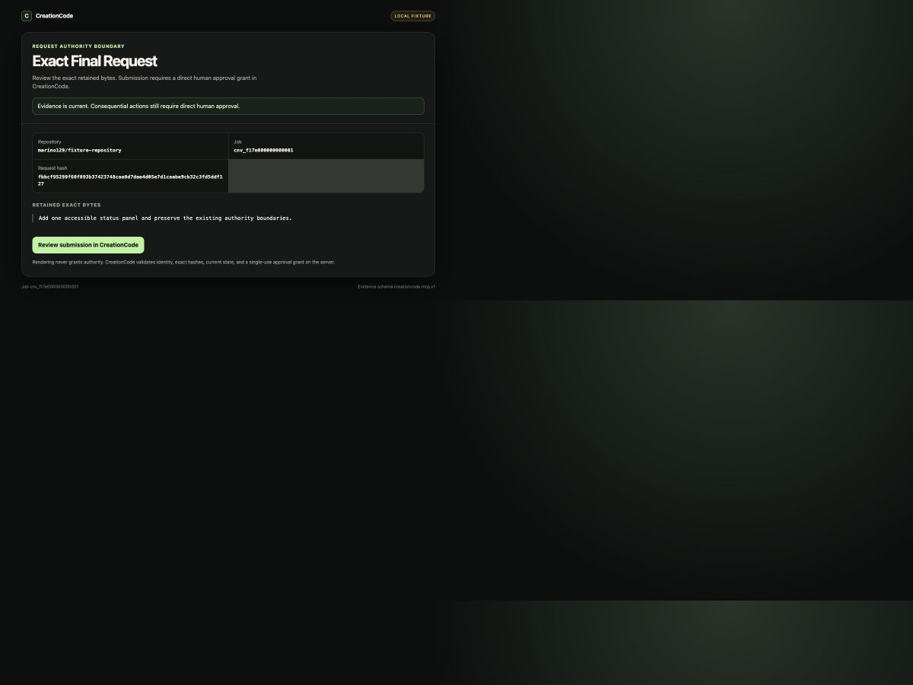
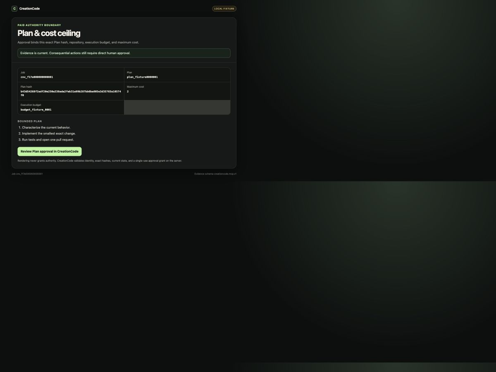
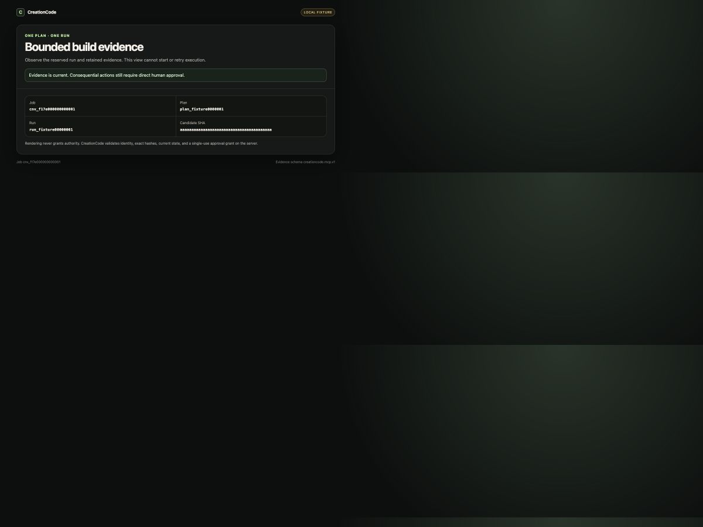
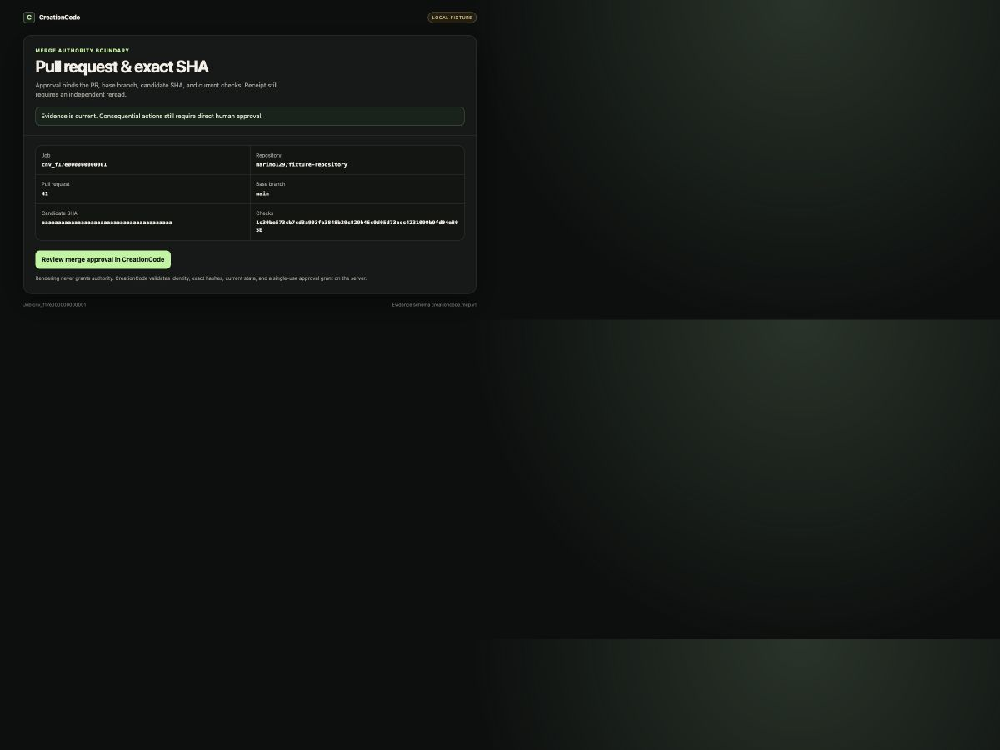
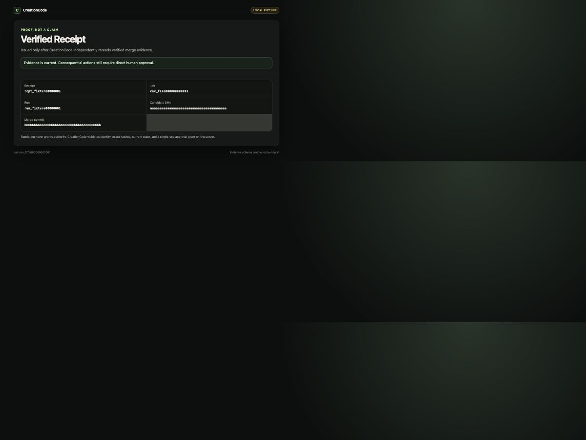

# CreationCode connector — launch package (blocked draft)

> **Do not install, publish, or submit this package yet.** The Receipt gate has PASSED (three consecutive verified production Receipts; first `rcpt_d4b8f6e292ebb7d96f48`, merges `2e204da7` → `afb70eb1` → `eae81a31`), and the live-bound MCP adapter exists on a draft branch — but the production route is not yet merged, deployed, or activated, and no OAuth provider is configured. This directory is review material only until the founder completes those steps.

CreationCode turns a conversation into one exact, human-authorized, bounded software delivery chain:

**Conversation → exact Final Request → Plan → human approval → one bounded build → PR → human merge approval → independent merge verification → Receipt**

Claude is the front door. CreationCode is the trusted control and proof layer. The connector does not create a second Request, Plan, execution, merge, ledger, or Receipt path; it is a remote MCP adapter over the same application services as the native web app.

## Intended remote connection

- Protocol: MCP `2026-07-28`
- Transport: modern stateless Streamable HTTP
- Planned endpoint: `https://creation-code.replit.app/mcp` (not registered or live)
- Authentication: OAuth resource server; trusted provider selection is pending
- GitHub credentials: server-held only; never delivered to Claude or Claude Code
- Human approval: trusted CreationCode-origin review and single-use grants

The draft tool catalog is:

1. `creationcode_start`
2. `creationcode_chat_send`
3. `creationcode_prepare_request`
4. `creationcode_submit_request`
5. `creationcode_get_job`
6. `creationcode_approve_and_build`
7. `creationcode_get_run`
8. `creationcode_get_pull_request`
9. `creationcode_approve_merge`
10. `creationcode_get_receipt`

Chat and Request preparation are non-authoritative. Submission, paid build approval, and merge approval require direct human interaction. Merge output cannot create a Receipt; Receipt retrieval succeeds only after CreationCode independently verifies the merge.

## Package contents

- [Draft manifest](./server.draft.json)
- [Claude and Claude Code instructions](./INSTALL.md)
- [Scopes and permission explanation](./PERMISSIONS.md)
- [Privacy and retention](./PRIVACY.md)
- [Security and approval model](./SECURITY.md)
- [Support and incident response](./SUPPORT.md)
- [Sample repository requirements](./SAMPLE_REPOSITORY.md)
- [Test-account requirements](./TEST_ACCOUNT.md)
- [Launch checklist](./LAUNCH_CHECKLIST.md)
- [Directory submission copy](./DIRECTORY_SUBMISSION.md)

## Local fixture evidence

These images are local mock evidence, not Claude-client or production proof.

## Current proof status

| Claim                                                                  | Status                            |
| ---------------------------------------------------------------------- | --------------------------------- |
| Official TypeScript v2 client discovery/list/call/MRTR/resources/cache | PASS locally                      |
| Five browser-rendered MCP App fixtures                                 | PASS locally                      |
| Claude Code                                                            | NOT PROVEN                        |
| Claude web/desktop                                                     | NOT PROVEN                        |
| OAuth provider and public endpoint                                     | NOT CONFIGURED                    |
| Live shared CreationCode authority services                            | BOUND on the draft branch (LiveCreationCodeApplicationServices over the native singletons); merge + activation pending |
| Production disabled                                                    | PASS                              |

Publishing requires explicit founder approval: reviewed code merged, external OAuth configuration, staging conformance, cross-client tests, and one MCP-driven production Receipt (the product already holds three native ones).
